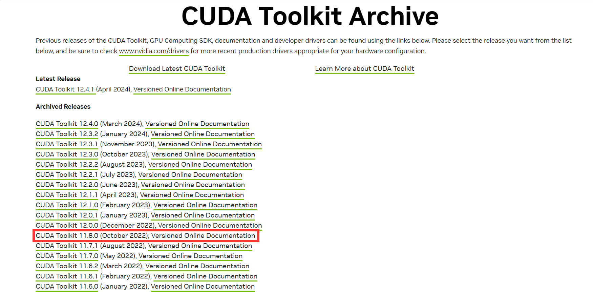
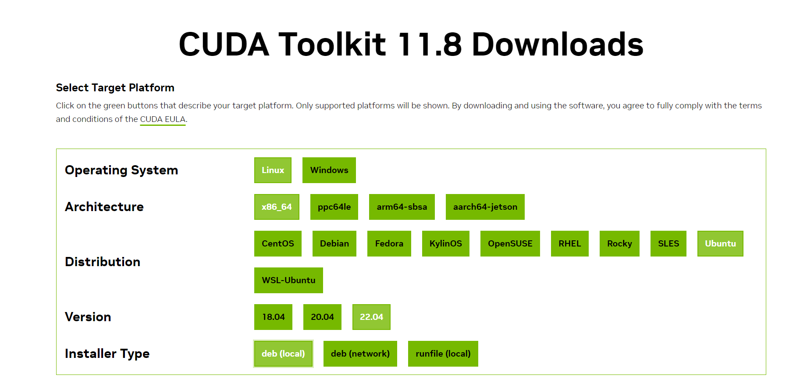
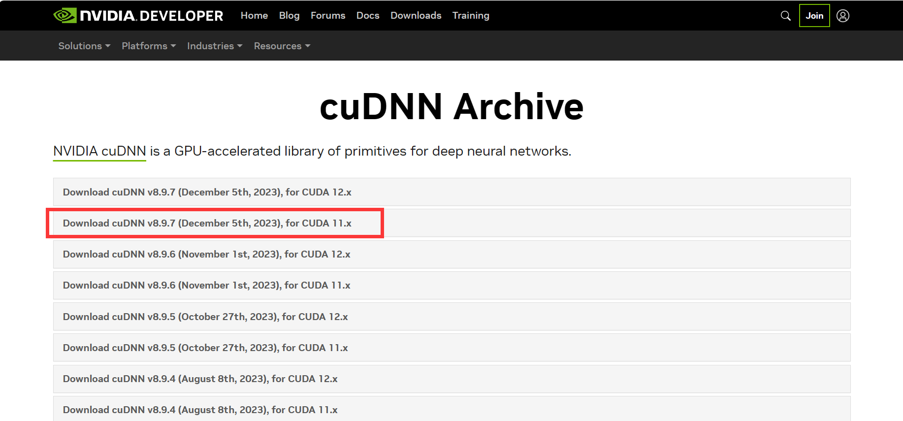
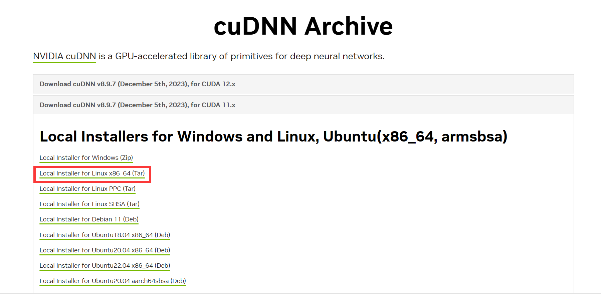

# Mamba安装-基于mamba源码进行cuda编译
本仓库旨在介绍如何在Linux环境下通过cuda编译的方式进行mamba模型（[https://github.com/state-spaces/mamba](https://github.com/state-spaces/mamba)）的安装，
可解决selective_scan_cuda包无法正常使用的问题。

Mamba论文bibtex引用如下：
```
@article{mamba,
  title={Mamba: Linear-Time Sequence Modeling with Selective State Spaces},
  author={Gu, Albert and Dao, Tri},
  journal={arXiv preprint arXiv:2312.00752},
  year={2023}
}
```
---
## 环境要求
- Python >= 3.9 （本案例使用python-3.10）
- CUDA >= 11.6 （本案例使用CUDA-11.8）
- Pytorch >= 1.12.1 （本案例使用torch-2.3.0）
- Linux（本案例使用Ubuntu-22.0.4）
  - 请先确定系统的GLIBC版本大于等于2.32（本案例使用2.35）， 否则会导致python无法正常import动态链接库（python >= 3.7 import动态链接库需要 GLIBC >= 2.32），
  如需查看GLIBC版本可使用以下命令查看：
  ```shell
  ldd --version
  ```
  - gcc，具体版本要求未知，本文使用11.4.0
  可用以下命令查看gcc版本
  ```shell
  gcc --version
  ```

# CUDA安装
- 本章节参考博客：https://www.gongsunqi.xyz/posts/3c995b2a/

首先需要在系统层面进行完整版CUDA安装（conda内也可以安装cuda，但只是精简版cuda，无法进行编译操作）。
## 安装CudaToolKit
先打开英伟达CudaToolKit官网：https://developer.nvidia.com/cuda-toolkit-archive ，然后选择cuda11.8（也可以按照自己的需求来选择其他版本，但是要求大于11.6）
<p align="center">
    
</p>
之后按照自己的系统情况进行选择：
<p align="center">
    
</p>

- 如果当前账户有root权限的话，Installer Type就正常选第一个就好，根据下方给出的提示进行安装即可。
``` shell
wget https://developer.download.nvidia.com/compute/cuda/repos/ubuntu2204/x86_64/cuda-ubuntu2204.pin
sudo mv cuda-ubuntu2204.pin /etc/apt/preferences.d/cuda-repository-pin-600
wget https://developer.download.nvidia.com/compute/cuda/11.8.0/local_installers/cuda-repo-ubuntu2204-11-8-local_11.8.0-520.61.05-1_amd64.deb
sudo dpkg -i cuda-repo-ubuntu2204-11-8-local_11.8.0-520.61.05-1_amd64.deb
sudo cp /var/cuda-repo-ubuntu2204-11-8-local/cuda-*-keyring.gpg /usr/share/keyrings/
sudo apt-get update
sudo apt-get -y install cuda
```
- 如果没有root权限的话，可以使用第三项runfile的方式进行安装，具体可以参考博客：https://blog.csdn.net/Dove_Dan/article/details/130667793
```shell
wget https://developer.download.nvidia.com/compute/cuda/11.8.0/local_installers/cuda_11.8.0_520.61.05_linux.run
sh cuda_11.8.0_520.61.05_linux.run
```
安装成功以后修改环境变量（如果想修改所有用户可以在前面加上sudo）：
```shell
nano ~/.bashrc
```
之后添加以下路径（注意，具体路径请修改为自己安装路径，代码示例为默认安装路径）：
```
export PATH=/usr/local/cuda-11.8/bin:$PATH
export LD_LIBRARY_PATH=/usr/local/cuda-11.8/lib64:$LD_LIBRARY_PATH
export CUDA_HOME=/usr/local/cuda-11.8
```
按下 ctrl+x 保存后，输入y两次回车即可，之后再执行：
```shell
source ~/.bashrc
```
接下来就可以输入：
```shell
nvcc -V
```
查看是否安装成功即可，正常应输出如下信息：
```
nvcc: NVIDIA (R) Cuda compiler driver
Copyright (c) 2005-2022 NVIDIA Corporation
Built on 你的安装时间
Cuda compilation tools, release 11.8, V11.8.89
Build cuda_11.8.r11.8/compiler.31833905_0
```

## cuDNN安装
先打开官网：https://developer.nvidia.com/rdp/cudnn-archive ，然后选择对应版本进行下载（本案例选择v8.9.7-11.x），这里下载需要注册NVIDIA账号
<p align="center">
    
</p>
之后选择
<p align="center">
    
</p>

然后将下载好的压缩包传到linux服务器中，并在终端cd到对应上传目录，然后进行解压：
```shell
tar -xvf cudnn**    # **省略部分按tab自动补全
```
解压完成后cd进解压文件夹，然后运行以下代码（如果没有root权限，cuda安装目录应当在自己账户目录下，此时以下命令无需sudo命令）：
```shell
sudo cp -r ./lib/* /usr/local/cuda-11.8（根据你的cuda安装目录进行修改）/lib64/
sudo cp -r ./include/* /usr/local/cuda-11.8（根据你的cuda安装目录进行修改）/include/
```
接下来修改权限：
```shell
sudo chmod a+r /usr/local/cuda-11.8（根据你的cuda安装目录进行修改）/include/cudnn*
sudo chmod a+r /usr/local/cuda-11.8（根据你的cuda安装目录进行修改）/lib64/libcudnn*
```
最后检查是否安装成功：
```shell
cat /usr/local/cuda-11.8（根据你的cuda安装目录进行修改）/include/cudnn_version.h | grep CUDNN_MAJOR -A 2
```
正常应输出以下信息：
```
#define CUDNN_MAJOR 8
#define CUDNN_MINOR 9
#define CUDNN_PATCHLEVEL 7
--
#define CUDNN_VERSION (CUDNN_MAJOR * 1000 + CUDNN_MINOR * 100 + CUDNN_PATCHLEVEL)

/* cannot use constexpr here since this is a C-only file */
```
至此，cuda安装完成。

# Mamba安装
## Anaconda安装（已安装可忽略）
这个网上教程一大堆，这里我就只简单说一下。
首先下载安装程序，方法有很多，下面提供两种方法
- 前往Anaconda官网（https://www.anaconda.com/download ）选择linux版本，直接下载
- 直接使用wget下载：
  ```shell
  wget https://repo.anaconda.com/archive/Anaconda3-2024.02-1-Linux-x86_64.sh
  ```
之后cd到你的下载目录，直接执行即可：
```shell
sh Anaconda3-2023.03-Linux-x86_64.sh
```
这里记得最后一步输入yes后再回车，然后重启终端即可。

## Conda环境创建和pytorch环境配置
先新建一个conda虚拟环境：
```shell
conda create -n mamba-env python=3.10
```
激活环境：
```shell
conda activate mamba-env
```
然后安装pytorch（这是使用pip下载，如需conda下载【conda下载最后得到的包文件名为pytorch，pip是torch】或者安装其他版本，具体命令可以前往Pytorch官网 https://pytorch.org/ ）:
```shell
pip3 install torch torchvision torchaudio --index-url https://download.pytorch.org/whl/cu118
```

---
### pytorch构建工具配置修改
先查看mamba-env环境路径
```shell
conda env list
```
然后进入具体环境路径后，打开`📁 lib`/`📁 python3.10`/`📁 site-package`/
`📁 torch`（conda下载为pytorch，pip下载为torch）/`📁 utils`/`cpp_extension.py`

在CUDA_GCC_VERSIONS和MINIMUM_CLANG_VERSION中添加11.8的版本信息
```python
CUDA_GCC_VERSIONS: VersionMap = {
    '11.0': (MINIMUM_GCC_VERSION, (10, 0)),
    '11.1': (MINIMUM_GCC_VERSION, (11, 0)),
    '11.2': (MINIMUM_GCC_VERSION, (11, 0)),
    '11.3': (MINIMUM_GCC_VERSION, (11, 0)),
    '11.4': ((6, 0, 0), (12, 0)),
    '11.5': ((6, 0, 0), (12, 0)),
    '11.6': ((6, 0, 0), (12, 0)),
    '11.7': ((6, 0, 0), (12, 0)),
    '11.8': ((6, 0, 0), (12, 0)),
}

MINIMUM_CLANG_VERSION = (3, 3, 0)
CUDA_CLANG_VERSIONS: VersionMap = {
    '11.1': (MINIMUM_CLANG_VERSION, (11, 0)),
    '11.2': (MINIMUM_CLANG_VERSION, (12, 0)),
    '11.3': (MINIMUM_CLANG_VERSION, (12, 0)),
    '11.4': (MINIMUM_CLANG_VERSION, (13, 0)),
    '11.5': (MINIMUM_CLANG_VERSION, (13, 0)),
    '11.6': (MINIMUM_CLANG_VERSION, (14, 0)),
    '11.7': (MINIMUM_CLANG_VERSION, (14, 0)),
    '11.8': (MINIMUM_CLANG_VERSION, (14, 0)),
}
```
---

安装packaging包（setup需要）：
```shell
conda install packaging
```

## causal-conv1d编译安装
causal-conv1d其实可以用pytorch自带的nn.Conv1d加padding的方式等价实现，但是效率相对较低，causal-conv1d库在cuda层面重构，效率更高。
首先打开causal-conv1d的github：https://github.com/Dao-AILab/causal-conv1d
然后通过git或者直接Download Zip源码的方式下载源码，之后修改源码文件夹中`setup.py`文件，将
```python
# FORCE_BUILD: Force a fresh build locally, instead of attempting to find prebuilt wheels
# SKIP_CUDA_BUILD: Intended to allow CI to use a simple `python setup.py sdist` run to copy over raw files, without any cuda compilation
FORCE_BUILD = os.getenv("CAUSAL_CONV1D_FORCE_BUILD", "FALSE") == "TRUE"
SKIP_CUDA_BUILD = os.getenv("CAUSAL_CONV1D_SKIP_CUDA_BUILD", "FALSE") == "TRUE"
# For CI, we want the option to build with C++11 ABI since the nvcr images use C++11 ABI
FORCE_CXX11_ABI = os.getenv("CAUSAL_CONV1D_FORCE_CXX11_ABI", "FALSE") == "TRUE"
```
修改为
```python
FORCE_BUILD = True
SKIP_CUDA_BUILD = False
FORCE_CXX11_ABI = False
```
再将
```python
cmdclass={"bdist_wheel": CachedWheelsCommand, "build_ext": BuildExtension}
```
修改为
```python
cmdclass={"bdist_wheel": CachedWheelsCommand, 'build_ext': BuildExtension.with_options(use_ninja=False)}
```
最后cd到causal-conv1d源码目录下，通过以下命令进行安装：
```shell
pip install .
```
安装完成后在python中运行：
```python
import torch
import causal_conv1d_cuda
```
没有报错即为成功。

## mamba-ssm编译安装
mamba-ssm安装流程和causal-conv1d安装流程基本一致，首先打开mamba官方库：https://github.com/state-spaces/mamba
然后通过git或者直接Download Zip源码的方式下载源码，之后修改源码文件夹中`setup.py`文件，将
```python
# FORCE_BUILD: Force a fresh build locally, instead of attempting to find prebuilt wheels
# SKIP_CUDA_BUILD: Intended to allow CI to use a simple `python setup.py sdist` run to copy over raw files, without any cuda compilation
FORCE_BUILD = os.getenv("MAMBA_FORCE_BUILD", "FALSE") == "TRUE"
SKIP_CUDA_BUILD = os.getenv("MAMBA_SKIP_CUDA_BUILD", "FALSE") == "TRUE"
# For CI, we want the option to build with C++11 ABI since the nvcr images use C++11 ABI
FORCE_CXX11_ABI = os.getenv("MAMBA_FORCE_CXX11_ABI", "FALSE") == "TRUE"
```
修改为
```python
FORCE_BUILD = True
SKIP_CUDA_BUILD = False
FORCE_CXX11_ABI = False
```
再将
```python
cmdclass={"bdist_wheel": CachedWheelsCommand, "build_ext": BuildExtension}
```
修改为
```python
cmdclass={"bdist_wheel": CachedWheelsCommand, 'build_ext': BuildExtension.with_options(use_ninja=False)}
```
最后cd到mamba-ssm源码目录下，通过以下命令进行编译安装：
```shell
pip install .
```
如需查看编译信息，可通过以下命令编译安装：
```shell
pip install . --no-cache-dir --verbose
```
这里需要下载hugging face库在内的大量依赖包，可能会出现网路超时等错误，重试即可。
之后编译时间可能会较久，因为mamba的cuda重写了不同精度的多种版本。
安装完成后在python中运行：
```python
import torch
import selective_scan_cuda
```
没有报错即为成功。

# 引用
如果该文档给到你帮助，请考虑引用我们的工作🤗：
```
@article{fan2024tim4rec,
  title={TiM4Rec: An Efficient Sequential Recommendation Model Based on Time-Aware Structured State Space Duality Model},
  author={Fan, Hao and Zhu, Mengyi and Hu, Yanrong and Feng, Hailin and He, Zhijie and Liu, Hongjiu and Liu, Qingyang},
  journal={arXiv preprint arXiv:2409.16182},
  year={2024}
}
```